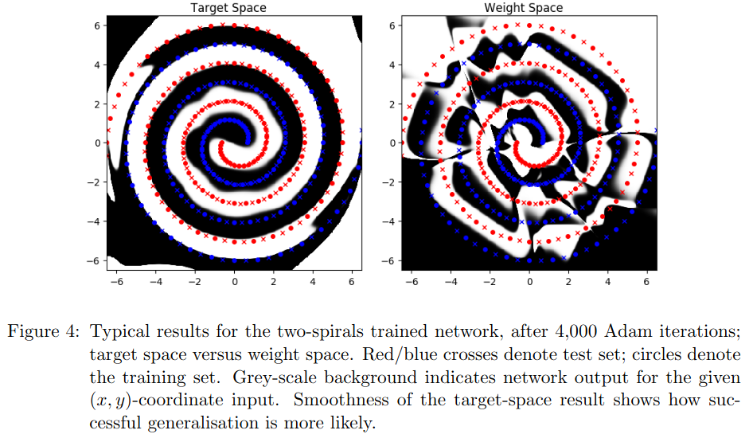

# dlts_paper_code

This code is to accompany the paper ["Deep Learning in Target Space."](https://jmlr.org/papers/v23/20-040.html) Fairbank, Michael, Spyridon Samothrakis, and Luca Citi. Journal of Machine Learning Research 23.8 (2022): 1-46.   Also published as [arXiv:2006.01578](https://arxiv.org/abs/2006.01578).

Please cite the above paper if this code or future variants of it are used in future academic work.  Also, we welcome contact from anyone who's found this code or method useful.

### Purpose

This is an under-development set of keras layers to implement the target-space method.

- Patches are welcome

- For the actual code used in the experiments in the paper, please see the sub folder "TF1 version", which should still work under TF2 using the built-in TF2 backwards compatibility.

## Running the code

- There are four runnable python scripts in this repository.

    - See the leading comments in each script for usage examples.

- The file ts_layers.py contains the main target-space program logic, including specific Keras layers for: 

    - CNN layers ("TSConv2D"), Dense Layer ("TSDense"), and RNN layer ("TSRNNDense")

## Dependencies

All were built using tensorflow v.2.x

Also used :

- Python 3.8

- numpy version 1.17, 

- pandas version 1.0.3 

## Two-Spirals result

When running the two spirals script, with the --graphical argument, we should see a result compatible with this figure from the paper:

