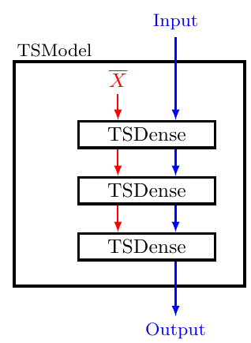

# dlts_paper_code


This code is to accompany the paper ["Deep Learning in Target Space"](https://jmlr.org/papers/v23/20-040.html), Michael Fairbank, Spyridon Samothrakis, and Luca Citi. Journal of Machine Learning Research 23.8 (2022): 1-46.   Also published as [arXiv:2006.01578](https://arxiv.org/abs/2006.01578).

Please cite the above paper if this code or future variants of it are used in future academic work.  Also, we welcome contact from anyone who's found this code or method useful.

### Purpose

This main folder contains a set of Keras layers to implement the target-space method.

- This code is still under development.

- For a stable version of this code, please see the subfolder "TF1 version", which contains the actual code used in the experiments in the paper.


## Running the code

- There are four runnable python scripts in this repository:

    - One fully-connected (dense) layered neural network example: [twoSpirals_target_space.py](./twoSpirals_target_space.py)
        
    - Two RNN examples: [rnn_bit_adder_target_space.py](./rnn_bit_adder_target_space.py) and [rnn_imdb_target_space.py](./rnn_imdb_target_space.py)
        
    - One CNN example: [cnn_target_space.py](./cnn_target_space.py)

    - See the leading comments in each script for usage examples.

- The file [ts_layers.py](./ts_layers.py) contains the main target-space program logic, including specific Keras layers for: 

    - CNN layers ("TSConv2D"), Dense Layer ("TSDense"), and RNN layer ("TSRNNDense")


### Building Target Space Models using ts_layers.py

To see how to use these target-space layers, see the four example python scripts in this repository.

However, to understand these further, a key concept is that once a Target Space "layer" (e.g. *TSDense*) is constructed,  its *call* method inputs and outputs TWO tensors (unlike *keras.Layers.Dense* which only inputs and outputs ONE tensor).  

The first of these two tensors inputted to *TSDense* has the variable name *target_input_matrix*.  This corresponds to the data being propagated through the network corresponding to the fixed input matrix $\overline{X}$ (described in the paper on page 9 and section 3.1), shown in red in the diagram below.  This quantity is used to convert the layer targets into ordinary weight matrices, and it needs propagating though the network, layer by layer: Hence the first output tensor from each *TSDense* layer needs passing as the first input tensor of the next layer. 

The second input matrix going into each *TSLayer* represents the shuffled mini-batch of data passing through the network, and also propagates through the network (shown in blue in the diagram below).  It is this output matrix from the neural network that we care about, and which would go into our training loss function.   



Example code of how to do this is in [twoSpirals_target_space.py](./twoSpirals_target_space.py):

```
class TSModel(keras.Model):
    ...
    
    def call(self, inputs):
        x=inputs
        x_targets=self.fixed_targets_input_matrix
        for l in self.tslayers:
            if isinstance(l, ts.TSLayer):
                x_targets,x=l([x_targets,x])
            else:
                x_targets,x=l(x_targets),l(x)
        return x
```

In the above code, *self.fixed_targets_input_matrix* plays the role of $\overline{X}$ from the paper, and *x_targets* holds this quantity as it propagates through the layers of the network (i.e. following the chain of red arrows in the above diagram).  Likewise, *x* holds the quantities propagating through the chain of blue arrows in the diagram.

Note that in this example, we have had to define a subclass from *keras.Model*, and override the model's *call* method (as above).  So we have to not only use *TSLayer*s, but also use them in a bespoke Model.  (There is no Keras "Functional API" or "Sequential" method currently available for using these keras target-space layers.  It's a pretty unusual demand we are placing on Keras layers here, so it requires fully overriding *keras.Model* to achieve what we want).

The above code snippet allows you to mix *TSLayer*s with ordinary *keras.Layers*.  For example we might want a *TSConv2D* layer followed by an ordinary *Flatten* layer, or ordinary *MaxPool* layer; so the above "if isinstance" statement allows that to happen.  

### What should you choose for the *fixed_targets_input_matrix*, $\overline{X}$?

This question is discussed in detail in section 3.1 of the paper. 

Most importantly though, this matrix must be fixed, and it must be a representative sample of the kind of inputs that will be passing through the neural network.

In the code examples in this repository, for the CNN datasets used (e.g. MNIST, CIFAR10, etc), we chose $\overline{X}$ to be the first 100 training images of the datasets.  For the two-spirals example, we used the entire training set (since the training set in that example only has a small number of instances).  For the IMDB RNN example, we used a random (fixed) noise matrix.  

In Fig 7 of the paper, we show that if the number of input vectors in $\overline{X}$ is too small, then performance can degrade.  However, on the other hand, you might *want* fewer input vectors in $\overline{X}$, as this will have a property of forcing your neural network's weight matrices to all become fairly low rank (which might have desirable properties for generalisation).


### Understanding *ts_layers.py*

The key step of the target space method, i.e. solving which weights matrix best achieves the desired "target" outputs for a given layer, requires the solution of a least-squares matrix equation.  This appears in equations (6) and (7) of the paper.  This step is performed by the following (simplification of the) code from the various *ts_layers.calculate_internal_weight_matrix* methods:

```
    from tensorflow.linalg import lstsq 

    def calculate_internal_weight_matrix(self, target_input_matrix):
        # Convert the target matrix into an ordinary weight matrix, by solving 
        # the least squares problem of linearly-transforming
        # the target input-matrix into the target output matrix.
        b=self.target_matrix # This is the target output matrix
        if self.use_bias:
            # bias nodes need incorporating into the input matrix for the last-squares method to find the bias weights at the same time as the main weights.
            inputs_with_bias=tf.concat([tf.ones_like(target_input_matrix[:,0:1]),target_input_matrix],axis=1)
        else:
            inputs_with_bias=target_input_matrix  
        return lstsq(inputs_with_bias, b, l2_regularizer=self.pseudoinverse_l2_regularisation)
```

This makes use of the very useful tensorflow [tf.linalg.lstsq](https://www.tensorflow.org/api_docs/python/tf/linalg/lstsq) function, which is doing a lot of work for us.

## Dependencies

All were built using tensorflow v.2.7

Also used :

- Python 3.8

- numpy version 1.17 

- pandas version 1.0.3 

## Two-Spirals result

When running the two spirals script, with the --graphical argument, we should see a result compatible with this figure from the paper:


## Issues

- See repository "Issues".  Patches are welcome. (We need a Keras Expert!)
