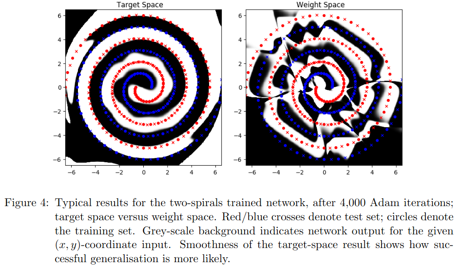

# dlts_paper_code (TF1 version)

This folder contains the actual TensorFlow 1.15 code used in the experiments in the paper ["Deep Learning in Target Space"](https://jmlr.org/papers/v23/20-040.html), Michael Fairbank, Spyridon Samothrakis, and Luca Citi. Journal of Machine Learning Research 23.8 (2022): 1-46.   Also published as [arXiv:2006.01578](https://arxiv.org/abs/2006.01578).

Please cite the above paper if this code or future variants of it are used in future academic work.  Also, we welcome contact from anyone who's found this code or method useful.

### Purpose

The purpose of the code in this subfolder is to archive the experiments performed in the above paper, and to make those results replicable.  

- Being written in Tensorflow version 1.15, this code is not inteded for use in future projects.  

- The Keras layers code in the main folder of this repository are easier to use for future work, and are are written for Tensorflow 2.

## Running the code

- There are four runnable python scripts in this repository, to replicate the four main experiments in the paper.

- See the leading comments in each script for usage examples.

## Dependencies

All were built using tensorflow v.1.15, but should still be compatible with Tensorflow versions 2.x, using the built-in TF2 backwards compatibility.

Also used :

- Python 3.8

- numpy version 1.17 

- pandas version 1.0.3 

## Two-Spirals result

When running the two spirals script, with the --graphical argument, we should see a result compatible with this figure from the paper:

